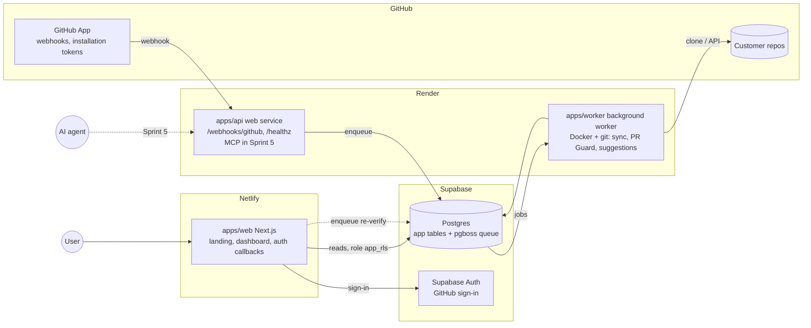

# whyanchor Cloud: Sprint 0 plan (Netlify + Render + Supabase)

Source: the "30-Day Sprints" artifact, Sprint 0 ("Foundations and design partners", days 1-2), adapted to your stack and checked against this repo as of 2026-10-07.

Sprint 0 goal, unchanged: **the skeleton runs end to end on staging, and partner outreach is under way so three teams are signed by day 6.**

---

## 0. Read this first: where the artifact and your stack disagree

The artifact assumes Neon/Supabase + Vercel + Fly/Railway + Inngest + Auth.js. Your stack changes five things, and the repo and the artifact disagree on a few more. Items marked **DECIDE** need your answer before Day 1 starts (the answers are collected in section 3).

| # | Artifact says | Reality / recommendation |
|---|---|---|
| 1 | Vercel for `apps/web` | **Netlify.** Next.js (App Router, route handlers, server actions, streaming) is supported through Netlify's OpenNext adapter. Keep it to UI, auth callbacks and light server reads. Netlify functions are the wrong place for git clones, webhooks that must ack fast, or the Sprint 5 MCP endpoint. |
| 2 | Worker on Fly/Railway | **Render.** Two services: `apps/api` (web service: GitHub webhooks now, hosted MCP in Sprint 5) and `apps/worker` (background worker, Docker image with `git` installed). |
| 3 | Inngest for jobs | **DECIDE. Recommend pg-boss on Supabase Postgres.** One less vendor, jobs live next to the data, and the worker is a plain Node process on Render. Inngest still works (it would call an endpoint on `apps/api`); it just adds an account and a public function endpoint. |
| 4 | Auth.js + GitHub | **DECIDE. Recommend Supabase Auth (GitHub provider).** It is already in your stack and gives you cookies and sessions through `@supabase/ssr`. Row-level security (below) works with either. |
| 5 | "Neon (or Supabase)" with dev/prod branches | **Two Supabase projects** (`dev`, `prod`), not branches. Supabase branching is a paid feature. |
| 6 | GitHub App permissions "contents read, metadata read, pull requests write, checks write. Nothing more." | **Inconsistent with Sprints 4 and 6.** "Update (opens a PR)" and "Approve opens a PR that adds the note" need **Contents: write**. See section 5 for the decision. |
| 7 | Install flow uses a Setup URL | **Use "Request user authorization (OAuth) during installation" instead.** With a bare Setup URL, `installation_id` is an unverified query parameter, so anyone can claim anyone's installation. The OAuth code lets you check the installation belongs to the signed-in user. GitHub disables the Setup URL field when this is on. |
| 8 | Invite a teammate by GitHub username (Sprint 1) | There is no table for pending invites in the artifact's schema. Added in section 6. |
| 9 | "gitignore `error-log.json`" | **Already done** (`.gitignore` line 4). Only the `demo/` changes are pending. |
| 10 | Move `src/` into packages | Moving files **will make existing `.memory` refs stale** (they point at `src/core/store.ts#loadEntries` etc.) and breaks the committed `.mcp.json` (`npx tsx src/cli.ts mcp`). Handled in Day 1 below. This is a good first dogfooding test for `whyanchor check`. |

Also worth knowing before you spend money:

- **Render free web services spin down when idle.** GitHub waits about 10 seconds for a webhook response and does not retry failed deliveries automatically, so a sleeping API silently drops events. Use a paid instance for `api`. Background workers have no free tier.
- **Supabase free projects pause after about a week of inactivity**, and the free plan has no daily backups. Fine for dev. Staging needs a keep-alive or the Pro plan, and prod needs Pro before you charge (Sprint 7 already lists backups).
- Two days is tight when the gating items (accounts, GitHub App, outreach) need *you*. The plan below runs two tracks in parallel so I never block on you and you never block on me.

---

## 1. Implementation plan

### Target repo layout (end of Day 1)

```
whyanchor/
├─ apps/
│  ├─ cli/        existing src/, tests/, graph-app/, scripts/. Still published as `whyanchor`
│  ├─ web/        Next.js 16, deploys to Netlify
│  ├─ api/        Hono (or Fastify). Render web service: /healthz, /webhooks/github
│  └─ worker/     pg-boss worker. Render background worker, Dockerfile with git
├─ packages/
│  ├─ core/       EMPTY SHELL in Sprint 0. Sprint 1 moves src/core here
│  └─ db/         Drizzle schema + SQL migrations + client factory
├─ .github/workflows/ci.yml
├─ netlify.toml
├─ render.yaml    Render Blueprint (api + worker)
├─ tsconfig.base.json
└─ package.json   private, "workspaces": ["apps/*", "packages/*"]
```

Two additions to the artifact's list: `apps/api` (you named a Render "backend API") and `packages/db` (so web, api and worker share one schema).

### Two tracks

- **Track M (me, in this repo):** repo cleanup, monorepo, CI, skeletons, migrations, deploy config, outreach drafts.
- **Track Y (you, in dashboards):** the accounts, the GitHub App, DNS, sending outreach. Section 4 is your click-by-click for the GitHub App.

### Day 1: repo, CI, infra wired

| Owner | Task | Done when |
|---|---|---|
| You | Answer the **DECIDE** items (section 3, "Decisions"). Product name and GitHub owner are the blockers. | Answers in chat |
| You | Send the outreach messages (I draft them, Appendix A). 15-20 team leads. Book calls. | Messages sent, tracker started |
| Me | **Demo changes:** `git diff demo/` is +392/-50, mostly a README rewrite. Once you say commit or discard, I do it. | `git status` clean |
| Me | Add `.gitattributes` (`* text=auto eol=lf`). Git currently warns that LF will become CRLF on all 5 demo files. whyanchor's staleness hashes are already LF-normalized, but your Windows checkout and Linux CI should agree. | Warning gone |
| Me | **Monorepo:** `git mv` (keeps history) `src`, `tests`, `graph-app`, `scripts` into `apps/cli`. Keep `name: "whyanchor"`, `bin`, `files`, and the `.npmignore` working. Root `package.json` becomes private with workspaces. Add `tsconfig.base.json`. Create empty `web`, `api`, `worker`, `core`, `db` packages. | `npm ci && npm test` green; `npm pack -w whyanchor --dry-run` lists the same files as before |
| Me | **Fix what the move breaks:** `.mcp.json` command to `npx tsx apps/cli/src/cli.ts mcp` (per memory `mem_7aLet5IZ`), the `scripts/prebuild|postbuild` paths, and Next's workspace-root warning (`turbopack.root`) for `graph-app`. Run `whyanchor check` and re-anchor stale refs. Capture one decision about the monorepo layout. | `whyanchor check` shows no new `[STALE]`/missing |
| Me | **CI** (`.github/workflows/ci.yml`): typecheck, test, build on every PR and on push to `master`. Details below. | Green on a PR |
| Me | `netlify.toml`, `render.yaml`, `apps/worker/Dockerfile`, `/healthz` on api, `/api/health` on web (does `select 1` against Supabase). | Files in repo, deploys succeed |
| You | Confirm Supabase `dev` project, Netlify site and Render services exist (you said they are deployed). Connect them to the repo (auto-deploy on `master`). Paste env vars into each dashboard (section 3 lists names). | Pushing to `master` triggers all three deploys |
| You | Create Sentry account (3 projects: web, api, worker). | DSNs in env vars |

CI details (`ci.yml`):
- Matrix: `ubuntu-latest` and `windows-latest`. The staleness code has had CRLF-specific bugs (memory `mem_Bk0gZk-f`), so one OS is not enough.
- `actions/checkout` with `fetch-depth: 0`, because staleness tests run `git rev-list` over history.
- Set `git config --global user.email/user.name` before tests; the tests create temp repos and commit in them.
- Node 22 (your machine runs 22.17; the package `engines` is `>=20.9`). Pin actions to current majors.
- Steps: `npm ci`, then typecheck, test and build with `--workspaces --if-present`.
- Do **not** publish from CI. Keep your manual `npm publish --ignore-scripts` flow (now `-w whyanchor`).
- After the first green run, turn on branch protection for `master` requiring the `verify` checks. I can do this through `gh api` if you approve.

### Day 2: GitHub App, domain, end-to-end hello world

| Owner | Task | Done when |
|---|---|---|
| You | Register the **development GitHub App** (section 4). Generate secrets. Put them in Render and Netlify env vars (never in chat or git). | App exists, installed on a sandbox repo |
| You | Buy the domain. Point `app.` at Netlify, `api.` at Render (custom domains), apex at the landing page. | HTTPS works on all three |
| Me | `apps/api`: `POST /webhooks/github` verifies `X-Hub-Signature-256` over the **raw body** with a constant-time compare, records `X-GitHub-Delivery` for idempotency, enqueues a job, returns 202 fast. | GitHub "Recent deliveries" shows 200 |
| Me | `apps/worker`: pg-boss connects, takes the job, logs it. Mints a GitHub installation token (App JWT → installation token, expires in 1 h), lists `GET /installation/repositories`. Proves a blobless clone works on Render: `git clone --filter=blob:none` with `x-access-token:<token>`. Cleans up the temp dir. | Log line "cloned N files, cleaned up" |
| Me | `apps/web`: landing page with waitlist form that writes to `public.waitlist` (rate-limited, honeypot). Sentry wired in all three apps. | Submission appears in Supabase |
| Me | Migration `0000_baseline` (section 6): extensions, roles, `waitlist`, RLS helper. Applied to `dev` and staging. | `drizzle-kit migrate` clean on both |
| You | Book partner calls. | Calls on the calendar |

**Sprint 0 "done" (the artifact's three, plus mine):**
1. "Hello world" page live on the staging URL.
2. CI green on `master`.
3. Partner calls booked.
4. (Mine) A real push to the sandbox repo travels GitHub → Render API → queue → Render worker → clone → cleanup, visible in logs and Sentry.
5. (Mine) The web app reads from and writes to Supabase on staging.

---

## 2. Prerequisites and setup tasks

**Tools on your machine** (check with `node -v`, `git --version`):
- Node 22 and npm 10+. Git 2.40+ (you have 2.40.1; `--filter=blob:none` needs 2.19+).
- Docker Desktop (to test the worker image locally). `gh` CLI (already logged in as `kishore600`).
- CLIs: `npx supabase`, `npm i -g netlify-cli`. The Render CLI is optional; the Blueprint does the job.
- For local webhook testing: a free smee.io channel (it forwards GitHub webhooks to localhost), or ngrok.

**Accounts:** GitHub (an org, see below), Supabase, Netlify, Render, Sentry, a domain registrar, an Anthropic API key (needed in Sprint 6, not now).

**GitHub owner.** Create a GitHub **organization** for the product now, instead of owning the App under `kishore600`. App names must be globally unique (max 34 chars) and the slug appears in the install URL, so the name decision gates the App. As I recall, GitHub Marketplace requires the listing app to be org-owned, so you would otherwise have to transfer it before Sprint 7 (verify when you list).

**Environments (cost-conscious):**

| Env | Web | API / worker | Database | GitHub App |
|---|---|---|---|---|
| local | `next dev` :3000 | `tsx` locally | Supabase `dev` | `…-dev` via smee.io |
| staging (deploys from `master`) | Netlify site + deploy previews for PRs | Render services (staging) | Supabase `dev` project | `…-dev` pointing at staging |
| prod (Sprint 7) | same Netlify site, production context | new Render services from the same `render.yaml` | Supabase `prod` (Pro) | production App |

Heads-up: design partners will install the **dev** App in Sprint 3 (day 14) and the production App only exists from day 28. Either make partners reinstall at launch, or register a long-lived "staging" App with the final permission set for them. I recommend the second.

---

## 3. What I need from you

**Rule: never paste secrets (private key, client secret, webhook secret, DB passwords, service keys) into chat.** Put them straight into the Netlify/Render dashboards or a local `.env.local` (gitignored). I only need the variable **names** and non-secret IDs.

### Decisions (blocking Day 1)

| # | Decision | My recommendation |
|---|---|---|
| 1 | Product/cloud name + domain | Pick today; the GitHub App slug depends on it |
| 2 | GitHub owner for the App | New org |
| 3 | `demo/` pending changes: commit or discard | Commit (it's the README rewrite + fixes from your last session) |
| 4 | Auth: Supabase Auth vs Auth.js | Supabase Auth |
| 5 | Jobs: pg-boss vs Inngest | pg-boss |
| 6 | API framework for `apps/api` | Hono |
| 7 | Contents: write timing (section 5) | Request write on the staging/prod Apps from the start |
| 8 | Regions (Render, Supabase, Netlify functions) | One region, same for Render and Supabase. Tell me yours |
| 9 | Render plan | Paid Starter for api + worker |
| 10 | One Render service or two (api + worker) | Two |

### Access I need

| What | Why | How |
|---|---|---|
| Repo admin on `kishore600/whyanchor` | Workflows, branch protection | I already see `gh` logged in; approve when I run `gh api` |
| Supabase **project ref** (dev, later prod) | `supabase link`, migrations | Run `npx supabase login` yourself, then tell me the project ref (it is in the URL, not a secret) |
| Netlify **site name** | `netlify.toml`, linking | `netlify login`, then `netlify link` |
| Render: connect repo, then **New → Blueprint** using my `render.yaml` | Creates api + worker | You click; I write the file |
| Sandbox repo | Safe target for webhook/clone tests | Create `<owner>/whyanchor-sandbox`, push `apps/cli/demo/fixture` into it |

### Environment variables (names only)

| Variable | Netlify web | Render api | Render worker | Where the value comes from |
|---|:-:|:-:|:-:|---|
| `APP_URL` | ✓ | ✓ | ✓ | Your domain |
| `DATABASE_URL_POOLED` | ✓ | | | Supabase → Connect → transaction pooler (6543), role `app_rls` |
| `DATABASE_URL` | | ✓ | ✓ | Supabase **session** pooler (5432). See note below |
| `NEXT_PUBLIC_SUPABASE_URL` | ✓ | | | Supabase → Settings → API |
| `NEXT_PUBLIC_SUPABASE_PUBLISHABLE_KEY` (formerly "anon") | ✓ | | | same |
| `GITHUB_APP_ID` | | ✓ | ✓ | App settings page |
| `GITHUB_APP_PRIVATE_KEY_B64` | | ✓ | ✓ | `.pem` file, base64-encoded (avoids multiline env issues). **Not on Netlify** |
| `GITHUB_WEBHOOK_SECRET` | | ✓ | | You generate it: `openssl rand -hex 32` |
| `GITHUB_APP_CLIENT_ID` / `GITHUB_APP_CLIENT_SECRET` | ✓ | | | App settings (for the install-callback code exchange) |
| `NEXT_PUBLIC_GITHUB_APP_SLUG` | ✓ | | | App name slug |
| `SENTRY_DSN` / `NEXT_PUBLIC_SENTRY_DSN` / `SENTRY_AUTH_TOKEN` | ✓ | ✓ | ✓ | Sentry |
| `ANTHROPIC_API_KEY` | | | ✓ (Sprint 6) | Not now |
| `WORK_DIR` (default `/tmp/whyanchor`) | | | ✓ | Fixed value |

The private key lives **only on Render**, since it can mint tokens for every installation. Netlify only ever holds the OAuth client secret.

Supabase connection note: the direct connection (port 5432 on `db.<ref>.supabase.co`) is IPv6-only unless you buy the IPv4 add-on. Render may fail to reach it (`ENETUNREACH`), so use the **session-mode pooler** string for api, worker and migrations. Netlify functions use the **transaction-mode** string (port 6543) with the pool size set to 1 and prepared statements off.

### Not mine to do

I will not create accounts, register the GitHub App, or handle passwords and keys. Everything in section 4 is yours. If you would rather not click through it, I can write a one-off GitHub App **manifest** script that registers the App from a prepared JSON, but you still approve it in your browser and download the key.

### Time-sensitive (Day 1 morning)

- **Outreach.** Partners are signed by day 6, and your own checkpoint says to stop building and do outreach if that slips. The earlier the messages go out, the more calls land inside Sprint 1.

---

## 4. Register and configure the GitHub App (dev)

Do this once for the dev/staging App. The production App repeats it in Sprint 7 with prod URLs.

1. Go to **GitHub → (your org) → Settings → Developer settings → GitHub Apps → New GitHub App**.
2. **GitHub App name:** `<product>-dev` (max 34 characters, globally unique). Note the slug GitHub derives.
3. **Description:** one line. Users see it on the install screen.
4. **Homepage URL:** your landing page.
5. **Identifying and authorizing users:**
   - **Callback URL** (up to 10 allowed): add both
     - `https://<staging-web-url>/api/github/callback`
     - `http://localhost:3000/api/github/callback`
   - **Expire user authorization tokens:** ✓ on.
   - **Request user authorization (OAuth) during installation:** ✓ on (finding 7 above).
   - **Enable Device Flow:** off.
6. **Post installation:** leave **Setup URL** empty (it is disabled when the OAuth box is on). **Redirect on update:** leave off.
7. **Webhook:**
   - **Active:** ✓.
   - **Webhook URL:** `https://<api-staging>.onrender.com/webhooks/github`. For local development use your smee.io URL instead.
   - **Secret:** the output of `openssl rand -hex 32`. Save it straight into Render (`GITHUB_WEBHOOK_SECRET`).
   - **SSL verification:** Enable.
8. **Permissions:** set the table in section 5.
9. **Subscribe to events:** tick the "Sprint 3" column in section 5. Events only appear as options after you grant the permissions behind them.
10. **Where can this GitHub App be installed?** Choose **Any account**. Design partners are other accounts, so "Only on this account" would block them.
11. **Create GitHub App.** On the next page:
    - Copy the **App ID** and **Client ID** (not secrets).
    - **Generate a new client secret**, paste into Netlify only.
    - **Generate a private key.** A `.pem` downloads once; base64-encode it and paste into Render as `GITHUB_APP_PRIVATE_KEY_B64`. Delete the local file or keep it in a password manager.
12. **Install it** on `whyanchor-sandbox` only (not "All repositories").
13. **Smoke tests:**
    - Advanced → **Recent deliveries** shows `installation` and `ping` with 200s.
    - Push a commit to the sandbox repo; a `push` delivery appears with 200, and the worker logs the job.
    - Tamper test: Redeliver after changing the secret in Render. The API must answer 401 and enqueue nothing.

Webhook handler rules (I build these; listed so you know what "done" means):
- Verify the HMAC over the raw bytes before parsing JSON. Compare in constant time.
- Respond within a couple of seconds. Do the work in the queue, never in the request.
- De-duplicate by `X-GitHub-Delivery`. GitHub does not retry failures on its own, so also plan a reconcile job (list recent deliveries via the API, or re-sync on a timer) before Sprint 2 ends.
- Treat installation access tokens as 1-hour secrets: never log them, and keep them out of clone URLs that end up in stored error text.

---

## 5. Required GitHub permissions, webhooks and OAuth settings

### Repository permissions

| Permission | Level | First needed | Why |
|---|---|---|---|
| **Metadata** | Read | automatic | Mandatory for every App |
| **Contents** | Read (Sprint 2) | Sprint 2 | Clone and read `.memory/entries` |
| **Pull requests** | Read & write | Sprint 3 | Read the diff and changed files; post and edit the PR comment |
| **Checks** | Read & write | Sprint 3 | Create the `whyanchor / decisions` Check Run |
| **Contents** | **Write** | **Sprint 4 / 6** | Create a branch and commit the note for "Update (opens a PR)" and "Approve" |
| Everything else (Issues, Actions, Administration, org and account permissions) | None | | Not needed |

**The Contents: write decision.** Changing permissions later makes every existing installation approve the new permission, and until they do, the App keeps its old permissions. Two options:
- **A (recommended):** the staging and prod Apps request Contents: write from day one. Partners see a slightly scarier prompt once.
- **B:** start read-only and accept one re-approval prompt in Sprint 4 (partners are friendly at that point).

Either way, the artifact's claim of "nothing more" should be corrected before the security page is drafted in days 23-26.

### Webhook events

| Event | Subscribe | Used by |
|---|---|---|
| `installation`, `installation_repositories` | Sent automatically to Apps. Confirm in Recent deliveries on first install; tick them if not | Track installs and repo picks (Sprint 2) |
| `push` | Sprint 3 column (needed from Sprint 2) | `sync-repo` job |
| `pull_request` (opened, synchronize, reopened, closed) | Sprint 3 | PR Guard; `closed` + merged triggers Sprint 6 suggestions |
| `pull_request_review`, `pull_request_review_comment` | Add in Sprint 6 | Suggestion extraction reads review comments |
| `check_run` (`requested_action`) | Add in Sprint 4 | "Acknowledge" button on the Check Run |
| `repository` (renamed, transferred, deleted) | Add in Sprint 2 | Keep the `repos` table honest |
| `github_app_authorization`, `meta` | Automatic | User revoked the App; App deleted |

Adding event subscriptions inside the permissions you already have does not trigger re-approval. Unhandled events should be acked 202 and dropped.

### OAuth: two separate things

| | Purpose | Settings |
|---|---|---|
| **GitHub OAuth App** (sign-in) | Log in to the dashboard | *Developer settings → OAuth Apps → New.* Homepage = web URL. Authorization callback URL = `https://<supabase-ref>.supabase.co/auth/v1/callback`. Paste Client ID/secret into **Supabase → Authentication → Providers → GitHub**. Scopes: `read:user`, `user:email`. In Supabase → Authentication → URL Configuration, set **Site URL** to the staging web URL and add redirect URLs for `http://localhost:3000/**` and your Netlify deploy previews |
| **GitHub App user authorization** (install) | Proves who installed; lists their installations to validate `installation_id` | Configured in step 5 above. Callback receives `code`, `installation_id`, `setup_action`. Exchange the code server-side, call `GET /user/installations`, and link only if the `installation_id` is in that list |

Why a separate OAuth App for sign-in instead of reusing the GitHub App's client: GitHub App user tokens ignore scopes and need an extra "Email addresses" account permission to read email, and Supabase's provider is built around OAuth Apps. Two login screens (sign-in, then install) is a small price.

---

## 6. Supabase schema and backend changes before Sprint 1

### Project setup (both projects)

- Two projects: `whyanchor-dev` (used by local + staging) and `whyanchor-prod` (Sprint 7).
- Same region as Render. Free-tier projects pause after about a week idle, so keep staging active or upgrade.
- Migrations with **Drizzle**: `packages/db` holds the schema and `drizzle-kit` output; RLS and role statements go in hand-written SQL migration files in the same folder. Drizzle has Supabase helpers (`drizzle-orm/supabase`, with `authUsers` for the FK to `auth.users`). One migration tool only; do not also use `supabase/migrations`.
- CI later runs `drizzle-kit migrate` against staging using the session-pooler URL, from a GitHub Actions **environment** secret.

### Migration `0000_baseline` (Sprint 0)

```sql
create extension if not exists citext with schema extensions;

-- Request-time role: web + api use it. NOT bypassrls, so RLS actually protects data.
create role app_rls login password '<generate, store in dashboards>' nobypassrls noinherit;
grant usage on schema public to app_rls;
alter default privileges in schema public
  grant select, insert, update, delete on tables to app_rls;
alter default privileges in schema public
  grant usage, select on sequences to app_rls;

-- Who is asking. Set per request, inside a transaction (works with the transaction pooler).
create schema if not exists app;
create function app.current_user_id() returns uuid
  language sql stable as
  $$ select nullif(current_setting('app.user_id', true), '')::uuid $$;

create table public.waitlist (
  id         uuid primary key default gen_random_uuid(),
  email      citext not null unique,
  source     text,
  created_at timestamptz not null default now()
);
alter table public.waitlist enable row level security;
create policy waitlist_insert on public.waitlist
  for insert to app_rls with check (true);   -- insert-only; nobody can read it through app_rls
```

Why the extra role: on Supabase the `postgres` role (and any table owner) bypasses RLS. If the web app queries as `postgres`, "Postgres row-level security" in Sprint 1 protects nothing. So: web and api connect as `app_rls` and begin each request with `select set_config('app.user_id', $1, true)` (the `true` makes it transaction-local). The **worker** connects as `postgres` (trusted, no user input).

Verify on the real project, not on paper:
1. `select rolbypassrls from pg_roles where rolname in ('postgres','app_rls');` The `app_rls` row must be `false`.
2. Connect as `app_rls`: `select * from waitlist;` must return permission denied or zero rows.
3. Create a throwaway table with RLS on and no policy, then confirm `app_rls` sees nothing.

Also in this migration's PR: `grant usage on schema extensions` as required, and turn off the Data API (PostgREST) for the `public` tables you don't want exposed: revoke privileges from `anon` and `authenticated` on application tables. The app talks to Postgres directly, so browser access via `supabase-js` should not exist for them.

### Sprint 1 schema (draft; final lives in the Sprint 1 PR)

```sql
create table public.users (
  id           uuid primary key references auth.users(id) on delete cascade,
  github_id    bigint not null unique,
  github_login citext not null,
  name         text,
  avatar_url   text,
  created_at   timestamptz not null default now()
);

create table public.workspaces (
  id         uuid primary key default gen_random_uuid(),
  slug       citext not null unique,
  name       text not null,
  created_by uuid not null references public.users(id),
  created_at timestamptz not null default now()
);

create table public.members (
  workspace_id uuid not null references public.workspaces(id) on delete cascade,
  user_id      uuid not null references public.users(id) on delete cascade,
  role         text not null check (role in ('owner','admin','member')),
  created_at   timestamptz not null default now(),
  primary key (workspace_id, user_id)
);

-- Missing from the artifact: "invite a teammate by GitHub username" needs somewhere to wait.
create table public.invites (
  id           uuid primary key default gen_random_uuid(),
  workspace_id uuid not null references public.workspaces(id) on delete cascade,
  github_login citext not null,
  role         text not null check (role in ('admin','member')),
  invited_by   uuid not null references public.users(id),
  expires_at   timestamptz not null default now() + interval '14 days',
  accepted_at  timestamptz,
  unique (workspace_id, github_login)
);
```

Policy pattern for every workspace-scoped table (one example):

```sql
alter table public.workspaces enable row level security;
create policy workspaces_select on public.workspaces for select to app_rls
  using (exists (select 1 from public.members m
                 where m.workspace_id = workspaces.id and m.user_id = app.current_user_id()));
```

The Sprint 1 isolation test ("a user from workspace A gets nothing for workspace B") should run against **`app_rls`**, not `postgres`, or it proves nothing.

### Needed before Sprint 2 (design now, build then)

Because these constrain the GitHub App setup:
- `installations` (`github_installation_id` unique, `account_login`, `account_type`, `workspace_id` nullable until linked, `suspended_at`)
- `repos` (`github_repo_id` unique, `installation_id`, `full_name`, `default_branch`, `enabled`, `last_synced_sha`)
- `decisions`, `decision_refs` (keyed by repo + the entry's `mem_…` id)
- `webhook_deliveries` (`delivery_id` primary key, `event`, `received_at`, `status`): idempotency and reconcile
- pg-boss creates its own `pgboss` schema on first start. It needs a session-capable connection (not the transaction pooler).
- Key everything on GitHub's numeric ids (`github_repo_id`, `github_installation_id`), never on repo names, because repos get renamed and transferred.

### Backend changes needed in the code (not the database)

- None required in `src/core` for Sprint 0. The core shells out to `git` via `execFile` (`src/core/git.ts`), so the worker image must have `git` on the PATH. That is the Dockerfile's main job.
- The staleness engine runs real git history commands (`rev-list --count`). On a blobless or shallow clone, a missing capture commit already reports as "unknown" instead of 0. Don't pass `--depth`; use `--filter=blob:none` only (the artifact is right about this).

---

## 7. Recommended deployment architecture



### What runs where and why

| Piece | Runs on | Reason |
|---|---|---|
| UI, auth callbacks, install callback, reads | **Netlify** (`apps/web`) | Static + SSR is what Netlify is for. Reads go straight to Postgres as `app_rls`, one fewer hop than going through the API |
| Webhook receiver, hosted MCP | **Render web service** (`apps/api`) | Must ack in seconds and stay always-on; MCP over streamable HTTP wants long-lived connections that Netlify functions don't give you |
| Git clone, staleness, PR diff, Claude calls | **Render background worker** (`apps/worker`, Docker) | Needs the `git` binary, minutes of runtime, and a disk. Netlify functions can't. Native Node runtime may lack git, so use a Dockerfile (`node:22-slim` + `apt-get install git`) |
| Database, queue, auth | **Supabase** | Single store for app data, `pgboss` jobs, and users |
| Jobs | **pg-boss** in Supabase | `web` enqueues by writing to the queue directly, so `web` never calls `api` over HTTP |

Design rules:
- **Private key only on Render.** Netlify holds only the OAuth client secret.
- **Two connection strings by caller:** Netlify uses the transaction pooler with `prepare: false` and pool size 1; Render uses the session pooler (or direct if IPv6 works).
- **Worker disk:** ephemeral. `mkdtemp` per job, `rm -rf` in a `finally`, store only notes and hashes (the artifact's own rule). Skip the persistent clone cache for now; blobless clones are cheap, and a persistent disk pins you to one worker instance.
- **Domains:** apex and `app.` on Netlify, `api.` on Render. The webhook URL and the MCP URL are the stable public contract, so give them the custom domain from the start; changing the GitHub App webhook URL later is a manual dashboard edit per App.
- **Observability:** Sentry in all three apps; a free uptime monitor on `/healthz` and `/api/health`; Render logs for the worker. Never log tokens, webhook bodies with private-repo content, or `Authorization` headers.
- **Cost shape** (verify current prices): Render Starter for api and worker, Supabase free until staging needs to stay awake and prod needs backups (then Pro), Netlify free. Combine api and worker into one Render service only if cost matters more than isolation.

### Config files I'll add

- `netlify.toml`: base directory, `npm ci` at the workspace root, build command `npm run build -w @whyanchor/web`, plus `NETLIFY_NEXT_SKEW_PROTECTION=true` if you want zero-downtime deploys.
- `render.yaml`: `whyanchor-api` (web, health check `/healthz`) and `whyanchor-worker` (worker, Docker), env var **names** declared with `sync: false` so values stay in the dashboard.
- `apps/worker/Dockerfile`.

---

## Appendix A: partner outreach (draft)

> Hi <name>, I'm building whyanchor, an open-source tool that stores the *why* behind code decisions in your repo and warns when a PR changes code a past decision depends on, for humans and AI agents alike. I'm looking for three teams to use the hosted version free for 3 months in exchange for 15 minutes of feedback every four days. Would you be up for a 20-minute call this week?

Tracker columns: name, company, team size, uses AI agents (which), repo host, date messaged, replied, call booked, signed. Sprint 0 target: 15-20 messaged, 5+ calls booked, 3 signed by day 6.
